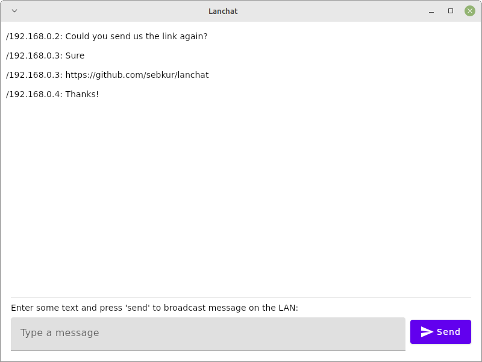

# Lanchat - an insecure (W)LAN messenger

It's like analogue radio, there's a bunch of channels and anybody can tune in.
Just choose your channel (a port in this case) and start sending and receiving
messages. Please keep in mind that this is totally insecure and everybody on
the same local network can read anything you send across the wire.

## Compose UI

There's a UI build with Compose for Desktop. To run it from the command line,
make sure to have a JDK 17 installed on your machine and on your path and
execute this:

    ./gradlew pinpitRun

It's possible to build packages for Windows, Debian / Ubuntu and macOS:

Build packages for all operating systems:

    ./gradlew pinpitPackageDefault

Build an MSI file:

    ./gradlew pinpitPackageDefaultMsiX64

Build macOS packages:

    ./gradlew pinpitPackageDefaultDistributableZipMacosArm64 pinpitPackageDefaultDistributableZipMacosX64

Build a Linux AppImage:

    ./gradlew pinpitPackageDefaultAppImageLinuxX64

Build a Debian / Ubuntu package:

    ./gradlew pinpitPackageDefaultDebUniversalX64

## Command line tools

There are also a few command line utilities that can be used to participate
in message and file exchange. To see a list of available subcommands, type:

    ./gradlew pinpitRun --args="--help"

Currently there are the following subcommands available:

    send <message>        # send message to other clients in the same network
    receive               # receive messages from other clients
    send-file <ip> <file> # send file to client at ip
    receive-file <file>   # receive file sent by other client

Most commands also have additional optional options. To see a help message for
a subcommand type:

    ./gradlew pinpitRun --args="send --help"

## Android

To build an APK for Android, run this:

    ./gradlew assembleDebug

Afterwards, install it using adb:

    adb install -r android/build/outputs/apk/debug/lanchat-android-debug.apk

## Building releases

For Google Play, build an `aab` package using:

    ./gradlew bundleRelease

To build a release `apk` instead:

    ./gradlew assembleRelease

## Technical details

The default port configured to broadcast messages is 5000.
The CLI uses port 5001 to send and receives files.
